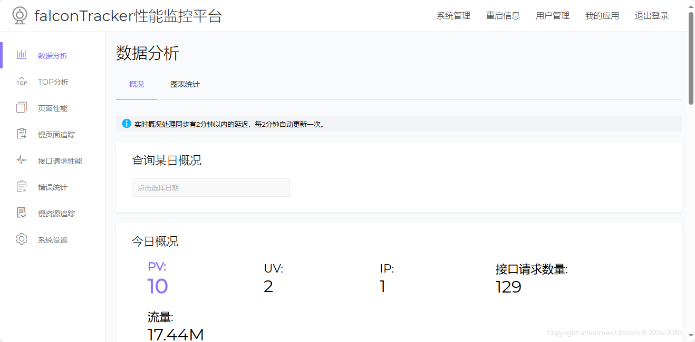
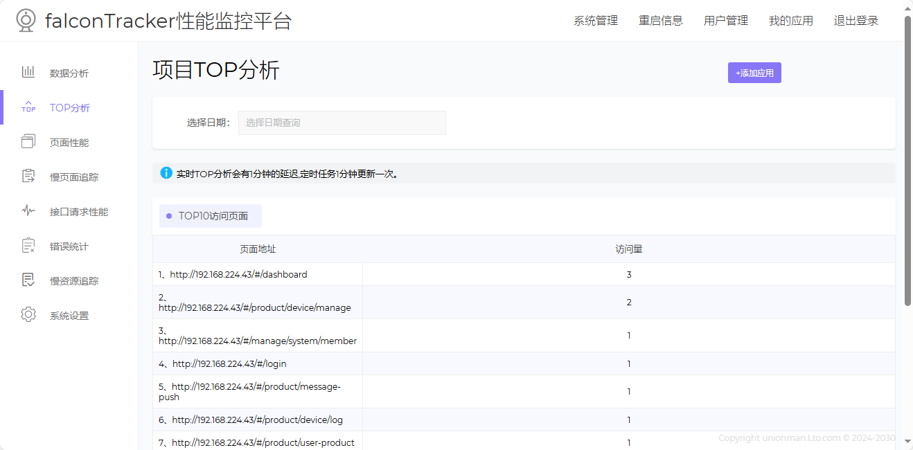
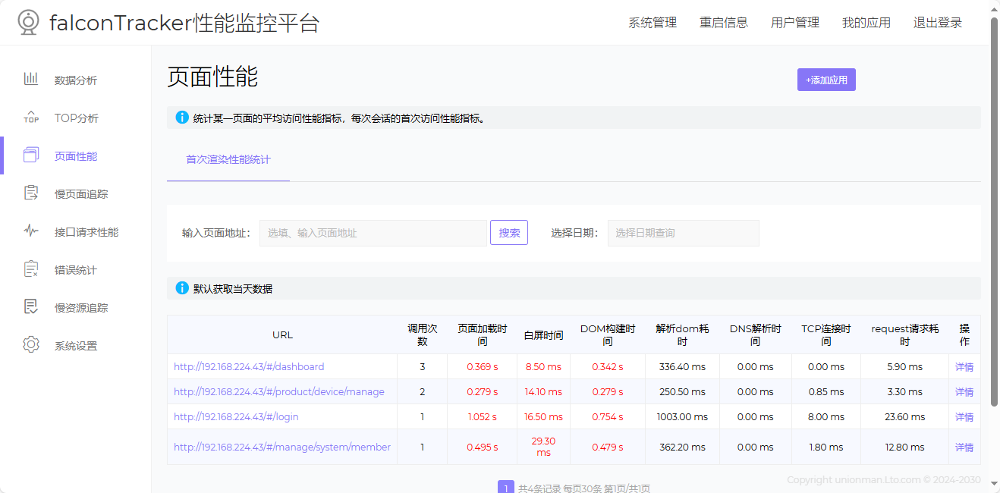
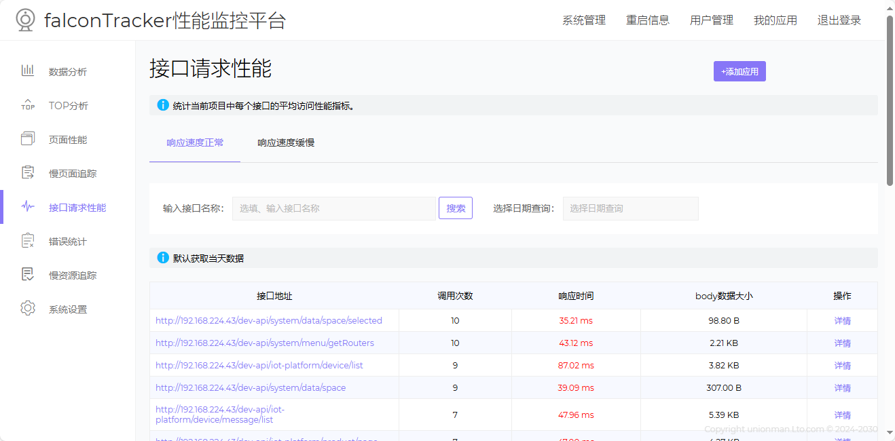
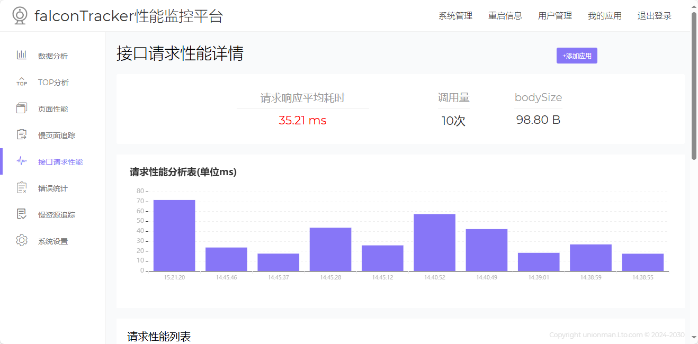
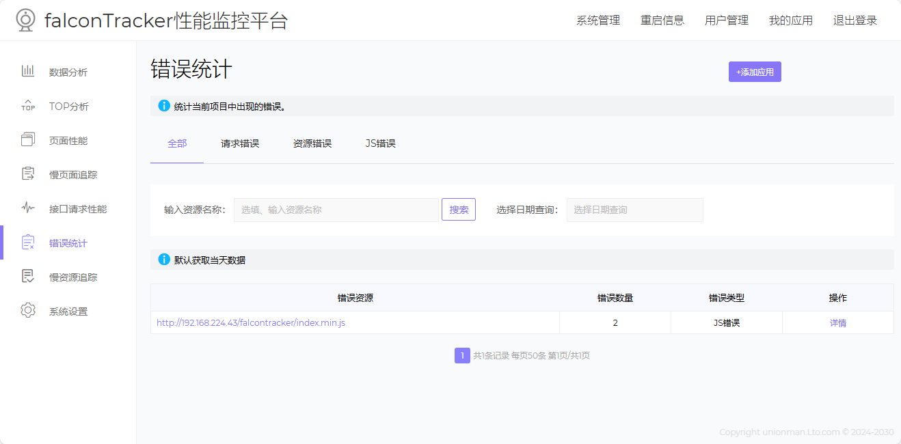
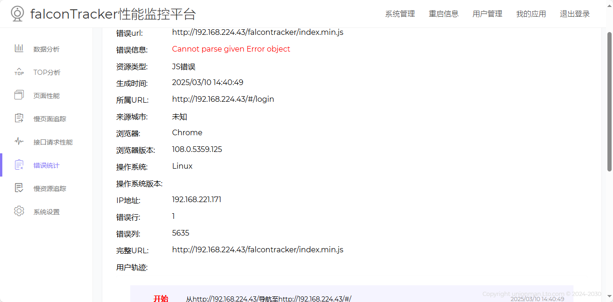
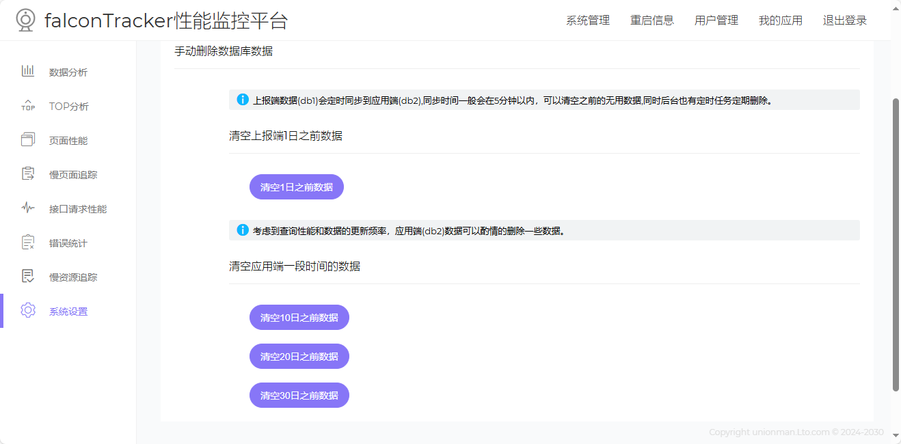
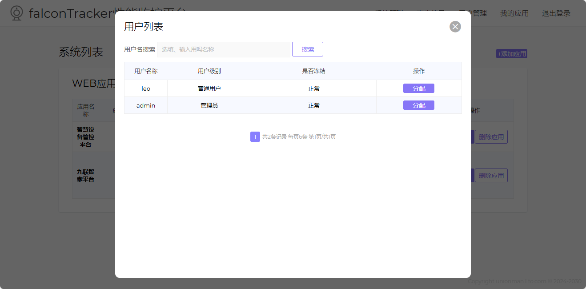

# platform-service

前端性能监控平台，主要用于展示 report-service 服务上报的数据。

## 安装

```bash
npm i
npm run dev
```

## 部署

```bash
npm start
npm stop
```

## 配置

在 config/config.default.js 中可以配置应用的 host、ip 等信息，其他信息直接使用默认的即可。

## 注册登录


在注册的时候，如果用户名为 admin，则默认为是管理员。

## 创建应用


需要先创建一个应用，并将 appId 放入到上报数据的 appId 字段中。

## 数据分析




可以查看应用当天的 pv、uv、ip、接口请求数量以及流量这些数据以及图表展示，并支持手动查询具体某日的数据。

## TOP 分析



展示页面访问数前十的页面链接以及浏览器种类。

## 页面性能相关

在创建应用的时候可以配置页面慢加载阀值。根据这个阈值，会将页面性能数据分成正常页面以及慢页面。




### 单页面平均性能


可以查看某页面的平均性能以及数据分析。

### 单页详情


可以查看某页面的详情信息，包含页面加载耗时、浏览器访问信息、web-vitals 指标以及首页渲染时需要加载的资源请求详情信息。

## 接口请求性能

在创建应用的时候可以配置请求慢加载阀值，根据这个阈值将接口请求分成正常响应以及慢响应。



### 接口请求平均数据



可以查看统一接口的平局数据。

### 接口请求详情


查看具体某次请求的详情数据

## 错误统计



在 falconTracker 中，错误被分为三种类型，js 错误、资源加载错误、以及请求错误。

### 错误详情



可以查看某次错误的具体信息，根据录制的页面信息，还可以进行页面回溯。

## 慢资源追踪

在创建应用的时候可以配置资源慢加载阀值，根据这个阈值将资源分成正常响应以及慢响应。

由于正常资源可能存在非常多（icon 这些），因此 falconTracker 不会收集正常资源，只收集慢资源。


**注意，对于首页渲染的资源不会进行过滤**


### 慢资源详情


## 系统设置




## 系统管理

可以删除应用或者给特定用户分配应用。


